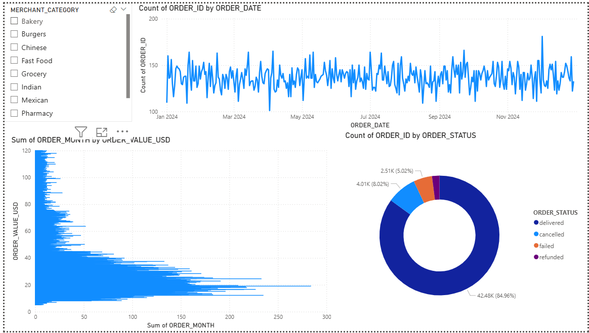
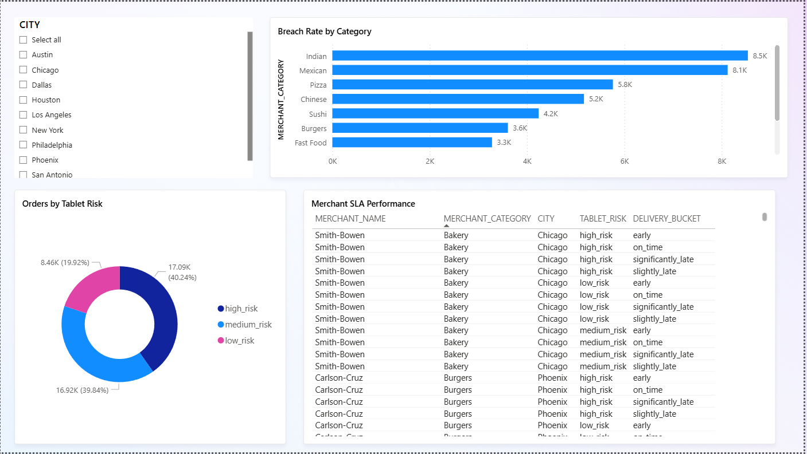
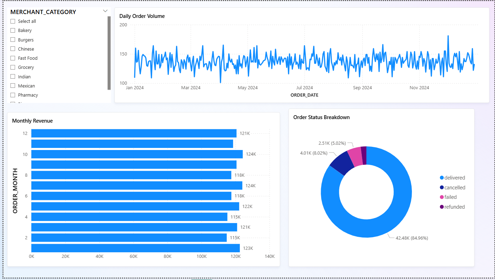

# 📦 Merchant Order Analytics Pipeline
**End-to-end analytics project built from scratch:**
Python → Snowflake → dbt → SQL → Power BI

---

## 🚀 What I Built & Why

I wanted to build a project that mirrors what actually happens inside food delivery and retail companies — ingest order data, clean it, find operational problems, and surface insights through dashboards that anyone can use.

I simulated a food delivery platform with 50 merchants across 10 US cities, generated a full year of realistic order data, and built every layer of the pipeline from scratch — no shortcuts, no pre-built datasets.

---

## 📊 Dashboard Screenshots

### KPI Overview

> 42.48K total orders · $1.22M revenue · 43.47% SLA breach rate · orders broken down by merchant category

### SLA Anomaly Detection

> Breach rate by category · orders by tablet risk · merchant-level SLA table filterable by city

### Order Trends

> Full year daily order volume · monthly revenue · order status breakdown showing 84.96% delivery success rate

---

## 🔧 Tools Used & What I Did With Each One

### Python (Google Colab)
- Used `Faker`, `pandas`, and `numpy` to generate 50,000 realistic order records
- Built real business logic into the data: peak hour penalties, seasonal multipliers (December 25% higher value), tablet age delays, SLA breach calculations
- Connected to Snowflake using `snowflake-connector-python`
- Built order volume forecasting with `scikit-learn` LinearRegression predicting Q1 2025 volumes
- Ran what-if ROI simulations to quantify the financial impact of replacing old tablets

### Snowflake
- Set up a cloud data warehouse from scratch
- Created internal stages and uploaded CSV files via `PUT` command
- Loaded 50,000 rows using `COPY INTO` with custom file format handling
- Built `MERCHANT_DB` database with `RAW` schema containing `ORDERS_RAW` and `MERCHANT_MASTER` tables

### dbt
- Installed and configured `dbt-snowflake` on Windows via Command Prompt
- Built 3 models across 2 layers:
  - **Staging:** `stg_orders` and `stg_merchants` — views that clean and cast raw data
  - **Marts:** `fct_orders` — materialized table with KPI flags, delivery buckets, tablet risk scores
- Wrote `sources.yml` with source definitions and column-level tests
- Ran `dbt test` — **6/6 data quality tests passed**

### SQL (Snowflake Worksheets)
Wrote 3 analytical SQL files using advanced SQL features:

**1. SLA Anomaly Detection**
- 3-level CTE structure calculating per-merchant breach rates
- Benchmarked each merchant against their category average
- `RANK() OVER (PARTITION BY category ORDER BY breach_rate DESC)` to rank merchants
- Flagged merchants as ANOMALY / WARNING / NORMAL

**2. 7-Day Rolling KPI Monitoring**
- `SUM() OVER (ROWS BETWEEN 6 PRECEDING AND CURRENT ROW)` for rolling order volume
- Rolling revenue, breach count, breach rate and avg delivery time across full 2024

**3. Order Volume Forecasting**
- `LAG()` for month-over-month growth
- `AVG() OVER (ROWS BETWEEN 2 PRECEDING AND CURRENT ROW)` for 3-month moving average
- `SUM() OVER (UNBOUNDED PRECEDING)` for year-to-date cumulative totals

### Power BI
- Connected directly to Snowflake using the native Power BI connector
- Imported `FCT_ORDERS`, `ORDERS_RAW`, `MERCHANT_MASTER` tables
- Created a DAX measure for SLA Breach Rate:
```
SLA Breach Rate = 
DIVIDE(
    COUNTROWS(FILTER(FCT_ORDERS, FCT_ORDERS[SLA_BREACHED] = TRUE())),
    COUNTROWS(FCT_ORDERS)
) * 100
```
- Built 3 dashboard pages with slicers, cards, bar charts, line charts and donut charts
- Added city and category slicers so anyone can filter and explore without needing SQL knowledge

---

## 📈 Key Results

### SLA Performance
- Overall SLA breach rate: **43.5%** across all delivered orders
- Indian and Mexican merchants handle the most volume but also have the highest breach counts
- **40.24% of orders come from high-risk tablets** (4-5 years old)

### Tablet Replacement ROI
| Metric | Value |
|--------|-------|
| Current SLA breach rate | 43.5% |
| Post-replacement breach rate | 33.2% |
| Breaches eliminated | 4,355 |
| **SLA breach reduction** | **23.6%** |
| Annual savings | $18,783 |
| Replacement cost (50 tablets) | $17,500 |
| **Net ROI Year 1** | **$1,283 positive** |
| Payback period | 11.2 months |

### Order Volume Forecast
- 2024 monthly average: **3,539 orders/month**
- Q1 2025 forecast: **~3,552–3,556 orders/month**
- December revenue confirmed as peak month — **25% higher** than January

---

## 🏗️ How It All Connects
```
┌──────────────┐    ┌─────────────────┐    ┌──────────────────┐    ┌────────────┐
│ Google Colab │───▶│   Snowflake      │───▶│       dbt        │───▶│  Power BI  │
│              │    │                 │    │                  │    │            │
│ Generate 50k │    │ ORDERS_RAW      │    │ stg_orders       │    │ KPI page   │
│ orders (CSV) │    │ MERCHANT_MASTER │    │ stg_merchants    │    │ SLA page   │
│ ML forecast  │    │ Staged CSV load │    │ fct_orders       │    │ Trends page│
│ ROI analysis │    │                 │    │ 6/6 tests pass   │    │ 3 slicers  │
└──────────────┘    └─────────────────┘    └──────────────────┘    └────────────┘
```

---

## 📁 Project Structure
```
merchant-order-analytics/
│
├── models/
│   ├── staging/
│   │   ├── stg_orders.sql          # Cleans + casts raw order data
│   │   ├── stg_merchants.sql       # Cleans merchant master data
│   │   └── sources.yml             # Source definitions + tests
│   └── marts/
│       └── fct_orders.sql          # Final fact table with KPI flags
│
├── dbt_project.yml                 # dbt project config
├── merchant_dashboard.pbix         # Power BI dashboard
├── KPI_Overview.png                # Dashboard screenshot
├── SLA_Anomaly.png                 # Dashboard screenshot
├── Order_Trends.png                # Dashboard screenshot
└── README.md
```

---

## ⚙️ How to Reproduce
```bash
# 1. Clone the repo
git clone https://github.com/dhrumi01/merchant-order-analytics.git

# 2. Install dbt
pip install dbt-snowflake

# 3. Configure Snowflake credentials in ~/.dbt/profiles.yml

# 4. Run dbt models
dbt run

# 5. Run data quality tests
dbt test

# 6. Open merchant_dashboard.pbix in Power BI Desktop
```

---

## 👩‍💻 Author

**Dhrumi** · [github.com/dhrumi01](https://github.com/dhrumi01)

---
> Built entirely from scratch. Every tool, every error, every fix — done hands-on.
